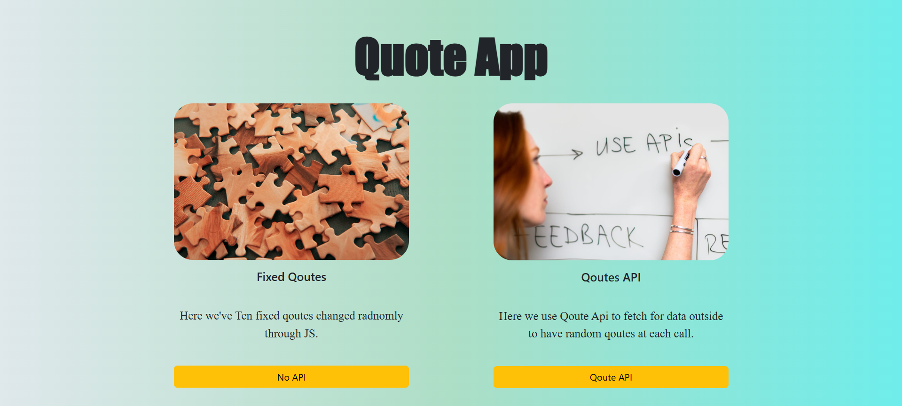
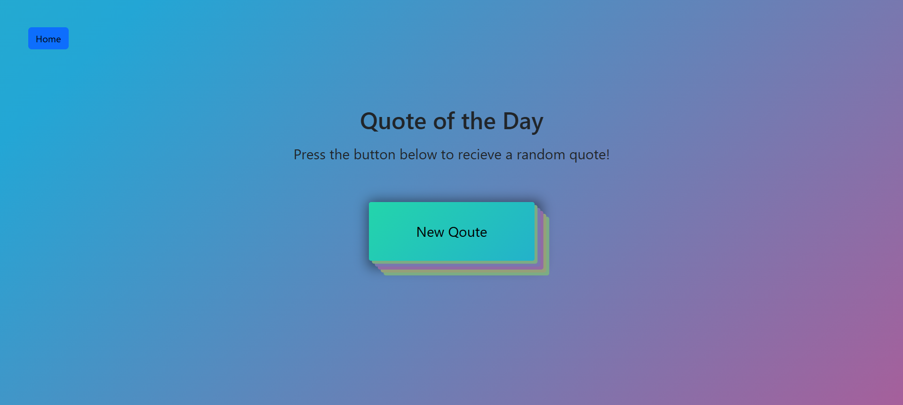

# qoute-pureJs-app
This is a Quote app (Module_Pure_JavaScript_App) which gives you random quote (totally different from prev one shown) each time you click in Quote Button provided.

### 📸 Screenshot:

# Tech Stack Used:
1- Pure JavaScript which handles:
1.1_ fetch_Api used to fetch Quotes from zenquotes_Api which gives a random quotes through URL: https://zenquotes.io/api/quotes.
1.2_ fetched data saved in localStorage as it comes with array of 50 different quotes through random logic and check on prev radnom number i dislay the quote (To avoid unnecssary fetching).
1.3_ Random_Fn gives random number from 0 to maxLength of Quotes given to it and check if the prev random_Number is the same with one provided or not to change it to new one through loop.
1.4_ Also have fixed Quotes predefined in Js_File exported to creates it only one and use it if user choose fixed Quotes instead of Fetched through Api one as i give him choice.
1.5_ Dom Mainpulation in textContent of two created P_Tags to at displaying qoutes.
1.6_ Dom Mainpulation  by maikng Flashing logic to make some fast Blur effect at each click on Quote Button.
1.7_ Listen in clcik events if current page isn't home page as home page has no Qoute button so i remove this listen event at hoem Page.
1.8_ Page check through BOM by window.location.href
1.9_ Some show and hide logic of loader through changing display in style attribute of loader element from none to flex and vise versa.
1.10_ Thorugh main.js i hadnle function need to each page (as it is small project) and Qoutes send to fucntion that handle display of Quotes in DOM.

2- Use serverless function in /api/qoutes.js to fetch api through it to avoid CORS thorugh vercel. Also i set header to allow access.

3- Bootstrap Framwork for Css.
4- Fontawesome for using Webfonts (Download files attached).
5- Merriweather_Font (Downlaod Files attached) To give more QuoteStyle to Quotes.
6- Animattion hadnels the (Flash_Effect , Button Pulse_Effect, Background_Gradient_Change_Effect) in qouteStyleSheet.css File.
7- react-hot-toast to display some idication for user at interacting with the page
